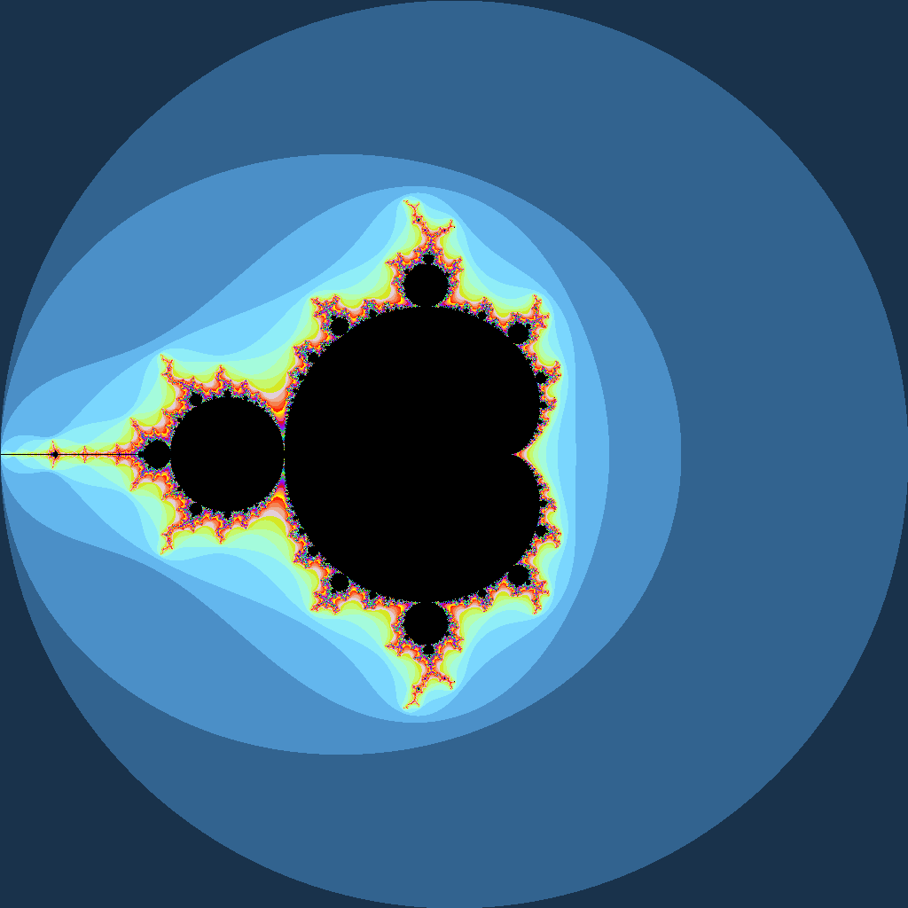

# Mandelbrot fractal generator

Generating a mandelbrot fractal with 200 max iterations and 1024x1024 resolution.

NOTE: Must be compiled with Intel C/C++ Compiler (lol) to use `_mm256_sin_ps` intrinsic. (Not really an intrinsic but anyway)

## Benchmark

| Method | Time (ms) | [Confidence interval](https://github.com/sheredom/ubench.h?tab=readme-ov-file#design) |
| ------ | --------- | ------------------------------------------------------------------------------------- |
| SISD   | 80.40     | +- 0.39%                                                                              |
| SIMD   | 13.74     | +- 0.86%                                                                              |

This means approximately a 5.85x performance increase with SIMD optimizations.

## Output

